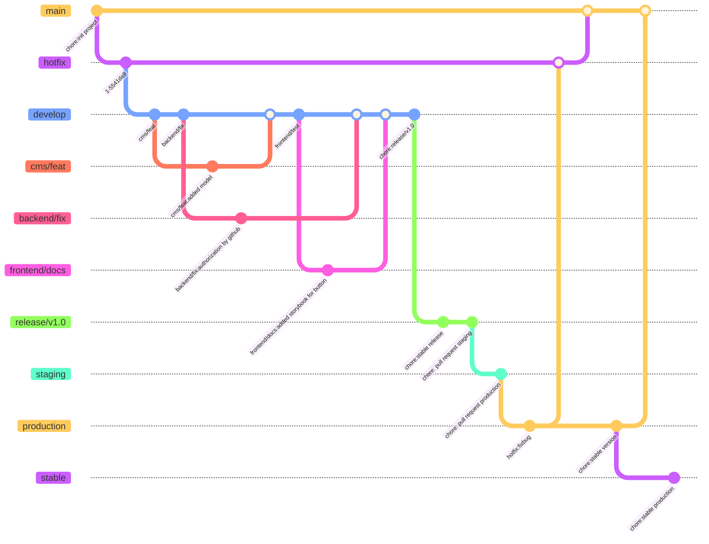

# Git Flow

```mermaid
%%{init: { 'logLevel': 'debug', 'theme': 'base', 'gitGraph': {'showBranches': true,'showCommitLabel': true}} }%%
gitGraph
    commit id:"chore:init project"
    branch hotfix
    commit
    branch develop
    checkout develop
    commit id:"cms/feat"
    branch cms/feat
    checkout main
    checkout develop
    commit id:"backend/fix"
    checkout cms/feat
    commit id:"cms/feat:added model"
    checkout develop
    branch backend/fix
    commit id:"backend/fix:authorization by github"
    checkout develop
    merge cms/feat
    commit id:"frontend/test"
    branch frontend/docs
    commit id:"frontend/docs:added storybook for button"
    checkout develop
    merge backend/fix
    merge frontend/docs
    commit id:"chore:release/v1.0"
    branch release/v1.0
    commit id:"chore:stable release"
    checkout release/v1.0
    commit id:"chore: pull request staging"
    branch staging
    commit id:"chore: pull request production"
    branch production
    checkout production
    commit id:"hotfix:fixbug"
    checkout hotfix
    merge production
    checkout main
    merge hotfix
    checkout production
    commit id:"chore:stable version"
    branch stable
    checkout stable
    checkout main
    merge production
    checkout stable
    commit id:"chore:stable production"
```

